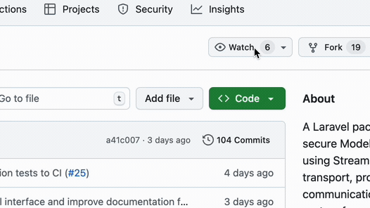

<h1 align="center">Laravel MCP Server by OP.GG</h1>

<p align="center">
  A powerful Laravel package to build a Model Context Protocol Server seamlessly
</p>

<p align="center">
<a href="https://github.com/opgginc/laravel-mcp-server/actions"></a>
<a href="https://packagist.org/packages/opgginc/laravel-mcp-server"></a>
<a href="https://packagist.org/packages/opgginc/laravel-mcp-server"></a>
<a href="https://packagist.org/packages/opgginc/laravel-mcp-server"></a>
</p>

<p align="center">
<a href="https://op.gg/open-source/laravel-mcp-server">Official Website</a>
</p>

<p align="center">
  <a href="README.md">English</a> |
  <a href="README.pt-BR.md">Português do Brasil</a> |
  <a href="README.ko.md">한국어</a> |
  <a href="README.ru.md">Русский</a> |
  <a href="README.zh-CN.md">简体中文</a> |
  <a href="README.zh-TW.md">繁體中文</a> |
  <a href="README.pl.md">Polski</a> |
  <a href="README.es.md">Español</a>
</p>

<p align="center">
  
</p>

## ✅ Version Information & Breaking Changes

### v1.5.0 Highlights (Oct 2025) ✅

Version 1.5.0 focuses on structured tool output, richer prompt support, and improved discoverability across the MCP protocol:

- **Structured tool responses** – Use `ToolResponse::structured()` to emit plain text and JSON payloads simultaneously. Existing tools keep returning JSON strings inside the `content` array for backwards compatibility, while new stubs expose a `$autoStructuredOutput = true` flag so array responses populate `structuredContent` and keep the required `content` field per the MCP 2025-11-25 specification. Tool interfaces optionally expose `title()` and `outputSchema()` so schema-aware clients can display richer results.
- **Tabular response helpers** – The new `FormatsTabularToolResponses` trait converts array data into CSV or Markdown tables with consistent MIME typing. Example tools and Pest tests demonstrate column normalization, validation, and multi-format output generation for data-heavy workflows.
- **Enhanced tool pagination & metadata** – Cursor-based pagination for `tools/list` scales to large catalogs, configurable per endpoint via `->toolsPageSize(...)`. The server advertises schema awareness and `listChanged` hints during capability negotiation, with integration tests covering `nextCursor` behavior.
- **Prompt registry & generator** – A full prompt registry backed by route endpoint definitions powers the new `prompts/list` and `prompts/get` handlers. Developers can scaffold prompts using `php artisan make:mcp-prompt`, while the service provider surfaces prompt schemas inside the MCP handshake for immediate client discovery.
- **Resource subscription parity** – Endpoints that enable `->resourcesSubscribe()` now accept `resources/subscribe` and `resources/unsubscribe` requests and return empty MCP results as defined by the 2025-11-25 schema. Endpoints that do not enable subscriptions correctly return `Method not found`.
- **Strict initialize validation** – The `initialize` request now validates required MCP fields (`protocolVersion`, `capabilities`, `clientInfo.name`, `clientInfo.version`) and consistently responds with the server-negotiated protocol version.

### Breaking Changes in v1.1.0 (May 2025)

Version 1.1.0 introduced a breaking change to the `ToolInterface`. Upgrading from v1.0.x requires refactoring every tool implementation. Refer to the [ToolInterface Migration Guide](docs/migrations/v1.1.0-tool-interface-migration.md) for automated and manual upgrade instructions.

## Overview of Laravel MCP Server

Laravel MCP Server is a powerful package designed to streamline the implementation of Model Context Protocol (MCP) servers in Laravel applications. **Unlike most Laravel MCP packages that use Standard Input/Output (stdio) transport**, this package focuses on **Streamable HTTP** transport, providing a secure and controlled integration method.

### Why Streamable HTTP instead of STDIO?

While stdio is straightforward and widely used in MCP implementations, it has significant security implications for enterprise environments:

- **Security Risk**: STDIO transport potentially exposes internal system details and API specifications
- **Data Protection**: Organizations need to protect proprietary API endpoints and internal system architecture
- **Control**: Streamable HTTP offers better control over the communication channel between LLM clients and your application

By implementing the MCP server with Streamable HTTP transport, enterprises can:

- Expose only the necessary tools and resources while keeping proprietary API details private
- Maintain control over authentication and authorization processes

Key benefits:

- Seamless and rapid implementation of Streamable HTTP in existing Laravel projects
- Support for the latest Laravel and PHP versions
- Efficient server communication and data processing
- Enhanced security for enterprise environments

## Key Features

- Streamable HTTP transport for MCP request/response flows
- Implementation of tools and resources compliant with Model Context Protocol specifications
- Simple routing and middleware configuration

### Transport

This package supports only `streamable_http` transport.

## Requirements

- PHP >=8.2
- Laravel >=10.x or Lumen >=9.x

## Installation

1. Install the package via Composer:

   ```bash
   composer require opgginc/laravel-mcp-server
   ```

2. Register one or more MCP endpoints in your route file:
   ```php
   use Illuminate\Support\Facades\Route;
   use OPGG\LaravelMcpServer\Services\ToolService\Examples\HelloWorldTool;
   use OPGG\LaravelMcpServer\Services\ToolService\Examples\VersionCheckTool;

   Route::mcp('/mcp')
       ->setName('OP.GG MCP Server')
       ->setVersion('1.5.2')
       ->tools([
           HelloWorldTool::class,
           VersionCheckTool::class,
       ]);
   ```

### Lumen Setup

The package also supports Lumen 9.x and newer applications. After installing the dependency via Composer:

1. Enable the optional helpers you need inside `bootstrap/app.php`:
   ```php
   $app->withFacades();
   $app->withEloquent();
   ```

2. Register the service provider:
   ```php
   $app->register(OPGG\LaravelMcpServer\LaravelMcpServerServiceProvider::class);
   ```

3. Register MCP routes explicitly (Lumen does not provide `Route::mcp()` macro):
   ```php
   use OPGG\LaravelMcpServer\Routing\McpRoute;
   use OPGG\LaravelMcpServer\Services\ToolService\Examples\HelloWorldTool;
   use OPGG\LaravelMcpServer\Services\ToolService\Examples\VersionCheckTool;

   McpRoute::register('/mcp')
       ->setName('OP.GG MCP Server')
       ->setVersion('1.5.2')
       ->tools([
           HelloWorldTool::class,
           VersionCheckTool::class,
       ]);
   ```


## Basic Usage

### 🔐 Authentication (CRITICAL FOR PRODUCTION)

> **⚠️ SECURITY WARNING:** Authentication is **ESSENTIAL** for production deployments. Without proper authentication, your MCP server endpoints are publicly accessible, potentially exposing sensitive data and operations.

The Laravel MCP Server uses Laravel's middleware system for authentication, providing flexibility to implement various authentication strategies. **By default, NO authentication is enabled** - you MUST configure it for production use.

#### Quick Start: Securing Your MCP Server

##### 1. Apply Authentication in Routes

```php
use Illuminate\Support\Facades\Route;

Route::middleware([
    'auth:sanctum',   // For Laravel Sanctum (recommended)
    'throttle:100,1', // Rate limiting
    'cors',           // CORS support if needed
])->group(function () {
    Route::mcp('/mcp')
        ->setName('Secure MCP')
        ->setVersion('1.5.2')
        ->tools([
            \App\MCP\Tools\MyCustomTool::class,
        ]);
});
```

##### 2. Option A: Laravel Sanctum (Recommended)

**Installation and Setup:**

```bash
# Install Sanctum
composer require laravel/sanctum

# Publish configuration
php artisan vendor:publish --provider="Laravel\Sanctum\SanctumServiceProvider"

# Run migrations
php artisan migrate
```

**Generate API Tokens for MCP Clients:**

```php
// In your application code or tinker
$user = User::find(1);
$token = $user->createToken('MCP Client')->plainTextToken;

// Use this token in your MCP client configuration
```

**Client Usage:**

```bash
# Include the Bearer token in your requests
curl -X POST http://your-server.com/mcp \
  -H "Authorization: Bearer YOUR_SANCTUM_TOKEN" \
  -H "Content-Type: application/json" \
  -d '{"jsonrpc":"2.0","id":1,"method":"tools/list"}'
```

##### 3. Option B: Custom API Key Authentication

**Create Custom Middleware:**

```php
// app/Http/Middleware/McpApiKeyAuth.php
<?php

namespace App\Http\Middleware;

use Closure;
use Illuminate\Http\Request;

class McpApiKeyAuth
{
    public function handle(Request $request, Closure $next)
    {
        $apiKey = $request->header('X-MCP-API-Key');
        
        // Validate against environment variable or database
        if ($apiKey !== config('mcp.api_key')) {
            return response()->json([
                'jsonrpc' => '2.0',
                'error' => [
                    'code' => -32001,
                    'message' => 'Unauthorized: Invalid API key'
                ]
            ], 401);
        }
        
        return $next($request);
    }
}
```

**Register the Middleware:**

```php
// app/Http/Kernel.php
protected $routeMiddleware = [
    // ... other middleware
    'mcp.auth' => \App\Http\Middleware\McpApiKeyAuth::class,
];
```

**Configure MCP Route Registration:**

```php
Route::middleware([
    'mcp.auth',        // Your custom API key middleware
    'throttle:100,1',  // Rate limiting
])->group(function () {
    Route::mcp('/mcp')->tools([
        \App\MCP\Tools\MyCustomTool::class,
    ]);
});

// .env file
MCP_API_KEY=your-secure-api-key-here
```

#### Advanced Security Configurations

##### IP Whitelisting

Restrict access to specific IP addresses:

```php
// app/Http/Middleware/McpIpWhitelist.php
class McpIpWhitelist
{
    public function handle(Request $request, Closure $next)
    {
        $allowedIps = config('mcp.allowed_ips', []);
        
        if (!empty($allowedIps) && !in_array($request->ip(), $allowedIps)) {
            return response()->json([
                'jsonrpc' => '2.0',
                'error' => [
                    'code' => -32004,
                    'message' => 'Access denied from this IP address'
                ]
            ], 403);
        }
        
        return $next($request);
    }
}
```

##### Role-Based Access Control (RBAC)

Control access to specific tools based on user roles:

```php
// app/Http/Middleware/McpRoleAuth.php
class McpRoleAuth
{
    public function handle(Request $request, Closure $next, string $role)
    {
        $user = auth()->user();
        
        if (!$user || !$user->hasRole($role)) {
            return response()->json([
                'jsonrpc' => '2.0',
                'error' => [
                    'code' => -32003,
                    'message' => 'Forbidden: Insufficient permissions'
                ]
            ], 403);
        }
        
        return $next($request);
    }
}
```

##### Audit Logging

Track all MCP requests for security monitoring:

```php
// app/Http/Middleware/McpAuditLog.php
class McpAuditLog
{
    public function handle(Request $request, Closure $next)
    {
        $response = $next($request);
        
        Log::channel('mcp_audit')->info('MCP Request', [
            'method' => $request->method(),
            'path' => $request->path(),
            'ip' => $request->ip(),
            'user_id' => auth()->id(),
            'payload' => $request->json()->all(),
            'status' => $response->getStatusCode(),
            'timestamp' => now(),
        ]);
        
        return $response;
    }
}
```

#### Environment-Specific Configuration

Configure different authentication strategies per environment:

```php
$mcpMiddlewares = array_filter([
    // Always apply rate limiting
    'throttle:' . env('MCP_RATE_LIMIT', '60') . ',1',
    
    // Authentication only in non-local environments
    env('APP_ENV') !== 'local' ? 'auth:sanctum' : null,
    
    // IP whitelisting for production
    env('APP_ENV') === 'production' ? 'mcp.ip.whitelist' : null,
    
    // Audit logging for production
    env('APP_ENV') === 'production' ? 'mcp.audit' : null,
    
    // CORS if needed
    env('MCP_CORS_ENABLED', false) ? 'cors' : null,
]);

Route::middleware($mcpMiddlewares)->group(function () {
    Route::mcp('/mcp')->tools([
        \App\MCP\Tools\MyCustomTool::class,
    ]);
});
```

#### Testing Authentication

Verify your authentication is working correctly:

```bash
# Test without authentication (should fail)
curl -X POST http://your-server.com/mcp \
  -H "Content-Type: application/json" \
  -d '{"jsonrpc":"2.0","id":1,"method":"tools/list"}'
# Expected: 401 Unauthorized

# Test with valid authentication
curl -X POST http://your-server.com/mcp \
  -H "Authorization: Bearer YOUR_TOKEN" \
  -H "Content-Type: application/json" \
  -d '{"jsonrpc":"2.0","id":1,"method":"tools/list"}'
# Expected: 200 OK with tools list

# Test rate limiting (make multiple rapid requests)
for i in {1..101}; do
  curl -X POST http://your-server.com/mcp \
    -H "Authorization: Bearer YOUR_TOKEN" \
    -H "Content-Type: application/json" \
    -d '{"jsonrpc":"2.0","id":'$i',"method":"ping"}'
done
# Expected: 429 Too Many Requests after limit exceeded
```

#### Security Best Practices

1. **Never expose MCP endpoints without authentication in production**
2. **Use HTTPS exclusively** - Never send authentication tokens over HTTP
3. **Implement rate limiting** to prevent abuse
4. **Rotate API keys/tokens regularly**
5. **Monitor and audit** all MCP requests
6. **Use environment variables** for sensitive configuration
7. **Implement IP whitelisting** for additional security when possible
8. **Consider OAuth2** for third-party integrations
9. **Test your authentication** thoroughly before deployment
10. **Document your authentication** method for your team

#### Common Authentication Patterns

##### Internal Services
For microservices or internal tools:
```php
'middlewares' => [
    'mcp.api.key',      // Simple API key
    'mcp.ip.whitelist', // Restrict to internal IPs
    'throttle:1000,1',  // Higher rate limit for internal use
]
```

##### Public API with User Authentication
For user-facing applications:
```php
'middlewares' => [
    'auth:sanctum',     // User authentication
    'throttle:60,1',    // Stricter rate limiting
    'cors',             // CORS for web clients
    'mcp.audit',        // Audit all requests
]
```

##### Partner Integration
For third-party integrations:
```php
Route::middleware([
    'auth:api',         // OAuth2 via Passport
    'throttle:100,1',   // Moderate rate limiting
    'mcp.partner.acl',  // Partner-specific access control
    'mcp.audit',        // Full audit trail
])->group(function () {
    Route::mcp('/partner-mcp')->tools([
        \App\MCP\Tools\MyCustomTool::class,
    ]);
});
```

### Creating and Adding Custom Tools

The package provides convenient Artisan commands to generate new tools:

```bash
php artisan make:mcp-tool MyCustomTool
```

This command:

- Handles various input formats (spaces, hyphens, mixed case)
- Automatically converts the name to proper case format
- Creates a properly structured tool class in `app/MCP/Tools`
- Prints route registration guidance for `Route::mcp(...)`

#### Generate Tools from Swagger/OpenAPI Specifications (v1.4.0+)

Automatically generate MCP tools from any Swagger/OpenAPI specification with a single command:

```bash
# From URL
php artisan make:swagger-mcp-tool https://api.example.com/swagger.json

# From local file
php artisan make:swagger-mcp-tool ./specs/openapi.json

# With options
php artisan make:swagger-mcp-tool https://api.example.com/swagger.json \
  --test-api \
  --group-by=tag \
  --prefix=MyApi
```

**Grouping Options (v1.4.1+):**

The generator now supports multiple ways to organize your generated tools and resources into directories:

```bash
# Tag-based grouping (default) - organize by OpenAPI tags
php artisan make:swagger-mcp-tool petstore.json --group-by=tag
# Creates: Tools/Pet/, Tools/Store/, Tools/User/

# Path-based grouping - organize by first path segment
php artisan make:swagger-mcp-tool petstore.json --group-by=path
# Creates: Tools/Api/, Tools/Users/, Tools/Orders/

# No grouping - everything in root directories
php artisan make:swagger-mcp-tool petstore.json --group-by=none
# Creates: Tools/, Resources/
```

**Enhanced Interactive Preview (v1.4.2):**

When you don't specify the `--group-by` option, the command shows a detailed preview with statistics:

```bash
php artisan make:swagger-mcp-tool petstore.json

🗂️ Choose how to organize your generated tools and resources:

Tag-based grouping (organize by OpenAPI tags)
📊 Total: 25 endpoints → 15 tools + 10 resources

  📁 Pet/ (8 tools, 4 resources)
     └─ CreatePetTool.php (POST /pet)
     └─ UpdatePetTool.php (PUT /pet)
     └─ ... and 10 more files
  📁 Store/ (5 tools, 3 resources)  
     └─ PlaceOrderTool.php (POST /store/order)
     └─ GetInventoryResource.php (GET /store/inventory)
     └─ ... and 6 more files
  📁 User/ (2 tools, 3 resources)
     └─ CreateUserTool.php (POST /user)
     └─ GetUserByNameResource.php (GET /user/{username})
     └─ ... and 3 more files

Path-based grouping (organize by API path)  
📊 Total: 25 endpoints → 15 tools + 10 resources

  📁 Pet/ (12 files from /pet)
     └─ PostPetTool.php (POST /pet)
     └─ GetPetByIdResource.php (GET /pet/{petId})
     └─ ... and 10 more files
  📁 Store/ (8 files from /store)
     └─ PostStoreOrderTool.php (POST /store/order)  
     └─ GetStoreInventoryResource.php (GET /store/inventory)
     └─ ... and 6 more files

No grouping (everything in root folder)
📊 Total: 25 endpoints → 15 tools + 10 resources

  📁 Tools/ (15 files directly in root)
     └─ CreatePetTool.php (POST /pet)
     └─ UpdatePetTool.php (PUT /pet/{petId})
     └─ ... and 13 more files
  📁 Resources/ (10 files directly in root)
     └─ GetPetByIdResource.php (GET /pet/{petId})
     └─ GetStoreInventoryResource.php (GET /store/inventory)  
     └─ ... and 8 more files

Choose grouping method:
  [0] Tag-based grouping
  [1] Path-based grouping  
  [2] No grouping
 > 0
```

The interactive preview shows:
- **Total counts**: How many tools and resources will be generated
- **Directory structure**: Actual directories that will be created
- **File examples**: Sample files with their corresponding API endpoints
- **File distribution**: Number of files per directory/group

**Real-world Example with OP.GG API:**

```bash
➜ php artisan make:swagger-mcp-tool https://api.op.gg/lol/swagger.json

🚀 Swagger/OpenAPI to MCP Generator
=========================================
📄 Loading spec from: https://api.op.gg/lol/swagger.json
✅ Spec loaded successfully!
+-----------------+-------------------------+
| Property        | Value                   |
+-----------------+-------------------------+
| Title           | OP.GG Api Documentation |
| Version         | openapi-3.0.0           |
| Base URL        | https://api.op.gg      |
| Total Endpoints | 6                       |
| Tags            | Riot                    |
| Security        |                         |
+-----------------+-------------------------+

🎯 What would you like to generate from this API?

Tools: For operations that perform actions (create, update, delete, compute)
Resources: For read-only data endpoints that provide information

Generate as:
  [0] Tools (for actions)
  > 1
  [1] Resources (for read-only data)
  > 1

✓ Will generate as MCP Resources

Would you like to modify the base URL? Current: https://api.op.gg (yes/no) [no]:
> no

📋 Select endpoints to generate resources for:
Note: Only GET endpoints can be converted to resources
Include tag: Riot (6 endpoints)? (yes/no) [yes]:
> yes

Selected 6 endpoints.
🛠️ Generating MCP resources...
Note: operationId '5784a7dfd226e1621b0e6ee8c4f39407' looks like a hash, will use path-based naming
Generating: LolRegionRankingsGameTypeResource
  ✅ Generated: LolRegionRankingsGameTypeResource
Generating: LolRegionServerStatsResource
  ✅ Generated: LolRegionServerStatsResource
...

📦 Generated 6 MCP resources:
  - LolRegionRankingsGameTypeResource
  - LolRegionServerStatsResource
  - LolMetaChampionsResource
  ...

✅ MCP resources generated successfully!
```

**Key Features:**
- **Automatic API parsing**: Supports OpenAPI 3.x and Swagger 2.0 specifications
- **Dual generation modes**: 
  - **Tools**: For operations that perform actions (POST, PUT, DELETE, etc.)
  - **Resources**: For read-only GET endpoints that provide data
- **Smart naming**: Converts paths like `/lol/{region}/server-stats` to `LolRegionServerStatsTool` or `LolRegionServerStatsResource`
- **Hash detection**: Automatically detects MD5-like operationIds and uses path-based naming instead
- **Interactive mode**: Select which endpoints to convert with real-time preview
- **API testing**: Test API connectivity before generating
- **Authentication support**: Automatically generates authentication logic for API Key, Bearer Token, and OAuth2
- **Flexible organization strategies**:
  - **Tag-based grouping**: Organize by OpenAPI tags (e.g., `Tools/Pet/`, `Tools/Store/`)
  - **Path-based grouping**: Organize by API path segments (e.g., `Tools/Api/`, `Tools/Users/`)
  - **Flat structure**: All tools and resources directly in root directories (`Tools/`, `Resources/`)
- **Interactive grouping preview**: See exactly how your files will be organized before generation
- **Code generation**: Creates ready-to-use classes with Laravel HTTP client integration

The generated tools include:
- Proper input validation based on API parameters
- Authentication headers configuration
- Error handling for API responses with JsonRpcErrorException
- Request retry logic (3 retries with 100ms delay)
- Query parameter, path parameter, and request body handling
- Laravel HTTP client with timeout configuration

You can also manually create tools and register them directly on a route endpoint:

```php
use Illuminate\Support\Facades\Route;
use OPGG\LaravelMcpServer\Services\ToolService\ToolInterface;

class MyCustomTool implements ToolInterface
{
    // Tool implementation
}

Route::mcp('/mcp')->tools([
    MyCustomTool::class,
]);
```

### Understanding Your Tool's Structure (ToolInterface)

When you create a tool by implementing `OPGG\LaravelMcpServer\Services\ToolService\ToolInterface`, you'll need to define several methods. Here's a breakdown of each method and its purpose:

```php
<?php

namespace OPGG\LaravelMcpServer\Services\ToolService;

interface ToolInterface
{
    // The unique, callable name of your tool (e.g., 'get-user-details').
    public function name(): string;

    // A human-readable description of what your tool does.
    public function description(): string;

    // Defines the expected input parameters for your tool using a JSON Schema-like structure.
    public function inputSchema(): array;

    // Provides a way to add arbitrary metadata or annotations to your tool.
    public function annotations(): array;

    // The core logic of your tool. Receives validated arguments and returns the result.
    public function execute(array $arguments): mixed;
}
```

Let's dive deeper into some of these methods:

**`name(): string`**

This is the identifier for your tool. It should be unique. Clients will use this name to request your tool. For example: `get-weather`, `calculate-sum`.

**`description(): string`**

A clear, concise description of your tool's functionality. This is used in documentation, and MCP client UIs (like the MCP Inspector) may display it to users.

**`inputSchema(): array`**

This method is crucial for defining your tool's expected input parameters. It should return an array that follows a structure similar to JSON Schema. This schema is used:

- By clients to understand what data to send.
- Potentially by the server or client for input validation.
- By tools like the MCP Inspector to generate forms for testing.

**Example `inputSchema()`:**

```php
public function inputSchema(): array
{
    return [
        'type' => 'object',
        'properties' => [
            'userId' => [
                'type' => 'integer',
                'description' => 'The unique identifier for the user.',
            ],
            'includeDetails' => [
                'type' => 'boolean',
                'description' => 'Whether to include extended details in the response.',
                'default' => false, // You can specify default values
            ],
        ],
        'required' => ['userId'], // Specifies which properties are mandatory
    ];
}
```

In your `execute` method, you can then validate the incoming arguments. The `HelloWorldTool` example uses `Illuminate\Support\Facades\Validator` for this:

```php
// Inside your execute() method:
$validator = Validator::make($arguments, [
    'userId' => ['required', 'integer'],
    'includeDetails' => ['sometimes', 'boolean'],
]);

if ($validator->fails()) {
    throw new JsonRpcErrorException(
        message: $validator->errors()->toJson(),
        code: JsonRpcErrorCode::INVALID_REQUEST
    );
}
// Proceed with validated $arguments['userId'] and $arguments['includeDetails']
```

#### Automatic structuredContent opt-in for array responses (v1.5+)

Laravel MCP Server 1.5 keeps backwards compatibility with legacy tools by leaving associative-array results as JSON strings under the `content` field. New installations created from the `make:mcp-tool` stub expose a `$autoStructuredOutput = true` property so array payloads are promoted into `structuredContent` while preserving a text mirror in `content` (required by MCP 2025-11-25).

To enable the new behaviour on an existing tool, declare the property on your class:

```php
class OrderLookupTool implements ToolInterface
{
    protected bool $autoStructuredOutput = true;

    public function execute(array $arguments): array
    {
        // Returning an array fills `structuredContent` and keeps JSON text in `content`.
        return [
            'orderId' => $arguments['id'],
            'status' => 'shipped',
        ];
    }
}
```

You can always bypass the flag by returning a `ToolResponse` instance directly—use `ToolResponse::structured()` when you need full control over both human-readable text and machine-readable metadata.

#### Formatting flat tool results as CSV or Markdown (v1.5.0+)

When your tool needs to return structured tabular data—like the `lol_list_champions` example—you can opt into richer response formats by returning a `ToolResponse`. The new helper trait `OPGG\LaravelMcpServer\Services\ToolService\Concerns\FormatsTabularToolResponses` provides convenience methods to turn flat arrays into CSV strings or Markdown tables. Nothing is automatic: simply `use` the trait in tools that need it.

```php
use OPGG\LaravelMcpServer\Services\ToolService\Concerns\FormatsTabularToolResponses;
use OPGG\LaravelMcpServer\Services\ToolService\ToolInterface;
use OPGG\LaravelMcpServer\Services\ToolService\ToolResponse;

class ChampionDirectoryTool implements ToolInterface
{
    use FormatsTabularToolResponses;

    public function name(): string { return 'champion-directory'; }
    public function description(): string { return 'Return champion metadata as tabular data.'; }
    public function inputSchema(): array { return []; }
    public function annotations(): array { return []; }

    public function execute(array $arguments): ToolResponse
    {
        $rows = [
            ['champion_id' => '1', 'key' => 'Annie', 'name' => 'Annie'],
            ['champion_id' => '2', 'key' => 'Olaf', 'name' => 'Olaf'],
        ];

        return match ($arguments['format'] ?? 'csv') {
            'markdown' => $this->toolMarkdownTableResponse($rows),
            default => $this->toolCsvResponse($rows),
        };
    }
}
```

Under the hood, `ToolResponse::text($string, $mime)` builds the response payload and sets the correct MIME type for `tools/call` responses (`text/csv`, `text/markdown`, etc.). The trait also exposes `toCsv()` and `toMarkdownTable()` helper methods if you prefer to work with raw strings or need to attach custom metadata via `toolTextResponse()`.

**`annotations(): array`**

This method provides metadata about your tool's behavior and characteristics, following the official [MCP Tool Annotations specification](https://modelcontextprotocol.io/docs/concepts/tools#tool-annotations). Annotations help MCP clients categorize tools, make informed decisions about tool approval, and provide appropriate user interfaces.

**Standard MCP Annotations:**

The Model Context Protocol defines several standard annotations that clients understand:

- **`title`** (string): A human-readable title for the tool, displayed in client UIs
- **`readOnlyHint`** (boolean): Indicates if the tool only reads data without modifying the environment (default: false)
- **`destructiveHint`** (boolean): Suggests if the tool may perform destructive operations like deleting data (default: true)
- **`idempotentHint`** (boolean): Indicates if repeated calls with the same arguments have no additional effect (default: false)
- **`openWorldHint`** (boolean): Signals if the tool interacts with external entities beyond the local environment (default: true)

**Important:** These are hints, not guarantees. They help clients provide better user experiences but should not be used for security-critical decisions.

**Example with standard MCP annotations:**

```php
public function annotations(): array
{
    return [
        'title' => 'User Profile Fetcher',
        'readOnlyHint' => true,        // Tool only reads user data
        'destructiveHint' => false,    // Tool doesn't delete or modify data
        'idempotentHint' => true,      // Safe to call multiple times
        'openWorldHint' => false,      // Tool only accesses local database
    ];
}
```

**Real-world examples by tool type:**

```php
// Database query tool
public function annotations(): array
{
    return [
        'title' => 'Database Query Tool',
        'readOnlyHint' => true,
        'destructiveHint' => false,
        'idempotentHint' => true,
        'openWorldHint' => false,
    ];
}

// Post deletion tool
public function annotations(): array
{
    return [
        'title' => 'Blog Post Deletion Tool',
        'readOnlyHint' => false,
        'destructiveHint' => true,     // Can delete posts
        'idempotentHint' => false,     // Deleting twice has different effects
        'openWorldHint' => false,
    ];
}

// API integration tool
public function annotations(): array
{
    return [
        'title' => 'Weather API',
        'readOnlyHint' => true,
        'destructiveHint' => false,
        'idempotentHint' => true,
        'openWorldHint' => true,       // Accesses external weather API
    ];
}
```

**Custom annotations** can also be added for your specific application needs:

```php
public function annotations(): array
{
    return [
        // Standard MCP annotations
        'title' => 'Custom Tool',
        'readOnlyHint' => true,

        // Custom annotations for your application
        'category' => 'data-analysis',
        'version' => '2.1.0',
        'author' => 'Data Team',
        'requires_permission' => 'analytics.read',
    ];
}
```

### Working with Resources

Resources expose data from your server that can be read by MCP clients. They are
**application-controlled**, meaning the client decides when and how to use them.
Create concrete resources or URI templates in `app/MCP/Resources` and
`app/MCP/ResourceTemplates` using the Artisan helpers:

```bash
php artisan make:mcp-resource SystemLogResource
php artisan make:mcp-resource-template UserLogTemplate
```

Register the generated classes on an endpoint with
`Route::mcp(...)->resources([...])->resourceTemplates([...])`. Each resource class extends the base
`Resource` class and implements a `read()` method that returns either `text` or
`blob` content. Templates extend `ResourceTemplate` and describe dynamic URI
patterns clients can use. A resource is identified by a URI such as
`file:///logs/app.log` and may optionally define metadata like `mimeType` or
`size`.

**Resource Templates with Dynamic Listing**: Templates can optionally implement a `list()` method to provide concrete resource instances that match the template pattern. This allows clients to discover available resources dynamically. The `list()` method enables ResourceTemplate instances to generate a list of specific resources that can be read through the template's `read()` method.

List available resources using the `resources/list` endpoint and read their
contents with `resources/read`. The `resources/list` endpoint returns an array
of concrete resources, including both static resources and dynamically generated 
resources from templates that implement the `list()` method:

```json
{
  "resources": [
    {
      "uri": "file:///logs/app.log",
      "name": "Application Log",
      "mimeType": "text/plain"
    },
    {
      "uri": "database://users/123",
      "name": "User: John Doe",
      "description": "Profile data for John Doe",
      "mimeType": "application/json"
    }
  ]
}
```

**Dynamic Resource Reading**: Resource templates support URI template patterns (RFC 6570) that allow clients to construct dynamic resource identifiers. When a client requests a resource URI that matches a template pattern, the template's `read()` method is called with extracted parameters to generate the resource content.

Example workflow:
1. Template defines pattern: `"database://users/{userId}/profile"`
2. Client requests: `"database://users/123/profile"`
3. Template extracts `{userId: "123"}` and calls `read()` method
4. Template returns user profile data for user ID 123

You can also list templates separately using the `resources/templates/list` endpoint:

```bash
# List only resource templates
curl -X POST https://your-server.com/mcp \
  -H "Content-Type: application/json" \
  -d '{"jsonrpc":"2.0","id":1,"method":"resources/templates/list"}'
```

When running your Laravel MCP server remotely, the HTTP transport works with
standard JSON-RPC requests. Here is a simple example using `curl` to list and
read resources:

```bash
# List resources
curl -X POST https://your-server.com/mcp \
  -H "Content-Type: application/json" \
  -d '{"jsonrpc":"2.0","id":1,"method":"resources/list"}'

# Read a specific resource
curl -X POST https://your-server.com/mcp \
  -H "Content-Type: application/json" \
  -d '{"jsonrpc":"2.0","id":2,"method":"resources/read","params":{"uri":"file:///logs/app.log"}}'
```

If you enable `->resourcesSubscribe()` on the endpoint, clients can also
subscribe to update notifications for specific URIs:

```bash
# Subscribe to updates for a resource URI
curl -X POST https://your-server.com/mcp \
  -H "Content-Type: application/json" \
  -d '{"jsonrpc":"2.0","id":3,"method":"resources/subscribe","params":{"uri":"file:///logs/app.log"}}'

# Unsubscribe from updates
curl -X POST https://your-server.com/mcp \
  -H "Content-Type: application/json" \
  -d '{"jsonrpc":"2.0","id":4,"method":"resources/unsubscribe","params":{"uri":"file:///logs/app.log"}}'
```

The server responds with JSON messages streamed over the HTTP connection, so
`curl --no-buffer` can be used if you want to see incremental output.

### Working with Prompts

Prompts provide reusable text snippets with argument support that your tools or users can request.
Create prompt classes in `app/MCP/Prompts` using:

```bash
php artisan make:mcp-prompt WelcomePrompt
```

Register them in an endpoint with `Route::mcp(...)->prompts([...])`. Each prompt class
extends the `Prompt` base class and defines:
- `name`: Unique identifier (e.g., "welcome-user")
- `description`: Optional human-readable description  
- `arguments`: Array of argument definitions with name, description, and required fields
- `text`: The prompt template with placeholders like `{username}`

List prompts via the `prompts/list` endpoint and fetch them using
`prompts/get` with arguments:

```bash
# Fetch a welcome prompt with arguments
curl -X POST https://your-server.com/mcp \
  -H "Content-Type: application/json" \
  -d '{"jsonrpc":"2.0","id":1,"method":"prompts/get","params":{"name":"welcome-user","arguments":{"username":"Alice","role":"admin"}}}'
```

### MCP Prompts

When crafting prompts that reference your tools or resources, consult the [official prompt guidelines](https://modelcontextprotocol.io/docs/concepts/prompts). Prompts are reusable templates that can accept arguments, include resource context and even describe multi-step workflows.

**Prompt structure**

```json
{
  "name": "string",
  "description": "string",
  "arguments": [
    {
      "name": "string",
      "description": "string",
      "required": true
    }
  ]
}
```

Clients discover prompts via `prompts/list` and request specific ones with `prompts/get`:

```json
{
  "method": "prompts/get",
  "params": {
    "name": "analyze-code",
    "arguments": {
      "language": "php"
    }
  }
}
```

**Example Prompt Class**

```php
use OPGG\LaravelMcpServer\Services\PromptService\Prompt;

class WelcomePrompt extends Prompt
{
    public string $name = 'welcome-user';
    
    public ?string $description = 'A customizable welcome message for users';
    
    public array $arguments = [
        [
            'name' => 'username',
            'description' => 'The name of the user to welcome',
            'required' => true,
        ],
        [
            'name' => 'role',
            'description' => 'The role of the user (optional)',
            'required' => false,
        ],
    ];
    
    public string $text = 'Welcome, {username}! You are logged in as {role}.';
}
```

Prompts can embed resources and return sequences of messages to guide an LLM. See the official documentation for advanced examples and best practices.

### Working with Notifications

Notifications are fire-and-forget messages from MCP clients that always return HTTP 202 Accepted with no response body. They're perfect for logging, progress tracking, event handling, and triggering background processes without blocking the client.

#### Creating Notification Handlers

**Basic command usage:**

```bash
php artisan make:mcp-notification ProgressHandler --method=notifications/progress
```

**Advanced command features:**

```bash
# Interactive mode - prompts for method if not specified
php artisan make:mcp-notification MyHandler

# Automatic method prefix handling
php artisan make:mcp-notification StatusHandler --method=status  # becomes notifications/status

# Class name normalization 
php artisan make:mcp-notification "user activity"  # becomes UserActivityHandler
```

The command provides:
- **Interactive method prompting** when `--method` is not specified
- **Automatic registration guidance** with copy-paste ready code
- **Built-in testing examples** with curl commands 
- **Comprehensive usage instructions** and common use cases

#### Notification Handler Architecture

Each notification handler must implement the `NotificationHandler` abstract class:

```php
abstract class NotificationHandler
{
    // Required: Message type (usually ProcessMessageType::HTTP)
    protected const MESSAGE_TYPE = ProcessMessageType::HTTP;
    
    // Required: The notification method to handle  
    protected const HANDLE_METHOD = 'notifications/your_method';
    
    // Required: Execute the notification logic
    abstract public function execute(?array $params = null): void;
}
```

**Key architectural components:**

- **`MESSAGE_TYPE`**: Usually `ProcessMessageType::HTTP` for standard notifications
- **`HANDLE_METHOD`**: The JSON-RPC method this handler processes (must start with `notifications/`)
- **`execute()`**: Contains your notification logic - returns void (no response sent)
- **Constructor validation**: Automatically validates required constants are defined

#### Built-in Notification Handlers

The package includes four pre-built handlers for common MCP scenarios:

**1. InitializedHandler (`notifications/initialized`)**
- **Purpose**: Processes client initialization acknowledgments after successful handshake
- **Parameters**: Client information and capabilities
- **Usage**: Session tracking, client logging, initialization events

**2. ProgressHandler (`notifications/progress`)**
- **Purpose**: Handles progress updates for long-running operations
- **Parameters**: 
  - `progressToken` (string): Unique identifier for the operation
  - `progress` (number): Current progress value
  - `total` (number, optional): Total progress value for percentage calculation
- **Usage**: Real-time progress tracking, upload monitoring, task completion

**3. CancelledHandler (`notifications/cancelled`)**
- **Purpose**: Processes request cancellation notifications
- **Parameters**:
  - `requestId` (string): ID of the request to cancel
  - `reason` (string, optional): Cancellation reason
- **Usage**: Background job termination, resource cleanup, operation abortion

**4. MessageHandler (`notifications/message`)**
- **Purpose**: Handles general logging and communication messages
- **Parameters**:
  - `level` (string): Log level (info, warning, error, debug)
  - `message` (string): The message content
  - `logger` (string, optional): Logger name
- **Usage**: Client-side logging, debugging, general communication

#### Example Handlers for Common Scenarios

```php
// File upload progress tracking
class UploadProgressHandler extends NotificationHandler
{
    protected const MESSAGE_TYPE = ProcessMessageType::HTTP;
    protected const HANDLE_METHOD = 'notifications/upload_progress';

    public function execute(?array $params = null): void
    {
        $token = $params['progressToken'] ?? null;
        $progress = $params['progress'] ?? 0;
        $total = $params['total'] ?? 100;
        
        if ($token) {
            Cache::put("upload_progress_{$token}", [
                'progress' => $progress,
                'total' => $total,
                'percentage' => $total ? round(($progress / $total) * 100, 2) : 0,
                'updated_at' => now()
            ], 3600);
            
            // Broadcast real-time update
            broadcast(new UploadProgressUpdated($token, $progress, $total));
        }
    }
}

// User activity and audit logging
class UserActivityHandler extends NotificationHandler
{
    protected const MESSAGE_TYPE = ProcessMessageType::HTTP;
    protected const HANDLE_METHOD = 'notifications/user_activity';

    public function execute(?array $params = null): void
    {
        UserActivity::create([
            'user_id' => $params['userId'] ?? null,
            'action' => $params['action'] ?? 'unknown',
            'resource' => $params['resource'] ?? null,
            'ip_address' => request()->ip(),
            'user_agent' => request()->userAgent(),
            'metadata' => $params['metadata'] ?? [],
            'created_at' => now()
        ]);
        
        // Trigger security alerts for sensitive actions
        if (in_array($params['action'] ?? '', ['delete', 'export', 'admin_access'])) {
            SecurityAlert::dispatch($params);
        }
    }
}

// Background task triggering
class TaskTriggerHandler extends NotificationHandler
{
    protected const MESSAGE_TYPE = ProcessMessageType::HTTP;
    protected const HANDLE_METHOD = 'notifications/trigger_task';

    public function execute(?array $params = null): void
    {
        $taskType = $params['taskType'] ?? null;
        $taskData = $params['data'] ?? [];
        
        match ($taskType) {
            'send_email' => SendEmailJob::dispatch($taskData),
            'generate_report' => GenerateReportJob::dispatch($taskData),
            'sync_data' => DataSyncJob::dispatch($taskData),
            'cleanup' => CleanupJob::dispatch($taskData),
            default => Log::warning("Unknown task type: {$taskType}")
        };
    }
}
```

#### Registering Notification Handlers

**In your service provider:**

```php
// In AppServiceProvider or dedicated MCP service provider
public function boot()
{
    $server = app(MCPServer::class);
    
    // Register built-in handlers (optional - they're registered by default)
    $server->registerNotificationHandler(new InitializedHandler());
    $server->registerNotificationHandler(new ProgressHandler());
    $server->registerNotificationHandler(new CancelledHandler());
    $server->registerNotificationHandler(new MessageHandler());
    
    // Register custom handlers
    $server->registerNotificationHandler(new UploadProgressHandler());
    $server->registerNotificationHandler(new UserActivityHandler());
    $server->registerNotificationHandler(new TaskTriggerHandler());
}
```

#### Testing Notifications

**Using curl to test notification handlers:**

```bash
# Test progress notification
curl -X POST http://localhost:8000/mcp \
  -H "Content-Type: application/json" \
  -d '{
    "jsonrpc": "2.0",
    "method": "notifications/progress",
    "params": {
      "progressToken": "upload_123",
      "progress": 75,
      "total": 100
    }
  }'
# Expected: HTTP 202 with empty body

# Test user activity notification  
curl -X POST http://localhost:8000/mcp \
  -H "Content-Type: application/json" \
  -d '{
    "jsonrpc": "2.0", 
    "method": "notifications/user_activity",
    "params": {
      "userId": 123,
      "action": "file_download",
      "resource": "document.pdf"
    }
  }'
# Expected: HTTP 202 with empty body

# Test cancellation notification
curl -X POST http://localhost:8000/mcp \
  -H "Content-Type: application/json" \
  -d '{
    "jsonrpc": "2.0",
    "method": "notifications/cancelled", 
    "params": {
      "requestId": "req_abc123",
      "reason": "User requested cancellation"
    }
  }'
# Expected: HTTP 202 with empty body
```

**Key testing notes:**
- Notifications return **HTTP 202** (never 200)
- Response body is **always empty**
- No JSON-RPC response message is sent
- Check server logs to verify notification processing

#### Error Handling and Validation

**Common validation patterns:**

```php
public function execute(?array $params = null): void
{
    // Validate required parameters
    if (!isset($params['userId'])) {
        Log::error('UserActivityHandler: Missing required userId parameter', $params);
        return; // Don't throw - notifications should be fault-tolerant
    }
    
    // Validate parameter types
    if (!is_numeric($params['userId'])) {
        Log::warning('UserActivityHandler: userId must be numeric', $params);
        return;
    }
    
    // Safe parameter extraction with defaults
    $userId = (int) $params['userId'];
    $action = $params['action'] ?? 'unknown';
    $metadata = $params['metadata'] ?? [];
    
    // Process notification...
}
```

**Error handling best practices:**
- **Log errors** instead of throwing exceptions
- **Use defensive programming** with null checks and defaults
- **Fail gracefully** - don't break the client's workflow
- **Validate inputs** but continue processing when possible
- **Monitor notifications** through logging and metrics

### Testing MCP Tools

The package includes a special command for testing your MCP tools without needing a real MCP client:

```bash
# Test a specific tool interactively
php artisan mcp:test-tool MyCustomTool

# List all available tools
php artisan mcp:test-tool --list

# Test with specific JSON input
php artisan mcp:test-tool MyCustomTool --input='{"param":"value"}'
```

This helps you rapidly develop and debug tools by:

- Showing the tool's input schema and validating inputs
- Executing the tool with your provided input
- Displaying formatted results or detailed error information
- Supporting complex input types including objects and arrays

### Visualizing MCP Tools with Inspector

You can also use the Model Context Protocol Inspector to visualize and test your MCP tools:

```bash
# Run the MCP Inspector without installation
npx @modelcontextprotocol/inspector node build/index.js
```

This will typically open a web interface at `localhost:6274`. To test your MCP server:

1. Start your Laravel server (for example, `php artisan serve`, Laravel Octane, or Nginx/Apache + PHP-FPM).
2. In the Inspector interface, enter your Laravel server's MCP endpoint URL (e.g., `http://localhost:8000/mcp`).
3. Connect and explore available tools visually

The MCP endpoint follows the exact path you register with `Route::mcp('/your-path')` (for example, `http://localhost:8000/mcp`).


## Translation README.md

To translate this README to other languages using Claude API (Parallel processing):

```bash
pip install -r scripts/requirements.txt
export ANTHROPIC_API_KEY='your-api-key'
python scripts/translate_readme.py
```

You can also translate specific languages:

```bash
python scripts/translate_readme.py es ko
```

## Deprecated Features for v2.0.0

The following features are deprecated and will be removed in v2.0.0. Please update your code accordingly:

### ToolInterface Changes

**Deprecated since v1.3.0 and now unsupported in runtime:**
- `messageType(): ProcessMessageType`
- `isStreaming(): bool`
- **Replacement:** Remove both methods and rely on standard HTTP responses.
- **Automatic Migration:** Run `php artisan mcp:migrate-tools` to remove legacy `messageType()` usage.

**Example Migration:**

```php
// Old approach (deprecated)
public function messageType(): ProcessMessageType
{
    return ProcessMessageType::HTTP;
}

// New approach
// Remove messageType()/isStreaming() and keep only the current ToolInterface methods.
```

### Removed Features

**Removed in v1.3.0:**
- `ProcessMessageType::PROTOCOL` enum case (consolidated into `ProcessMessageType::HTTP`)

**Planning for v2.0.0:**
- Complete removal of `messageType()` and `isStreaming()` from legacy tool implementations
- Streamable HTTP as the only supported transport
- Simplified tool configuration and reduced complexity

## License

This project is distributed under the MIT license.
